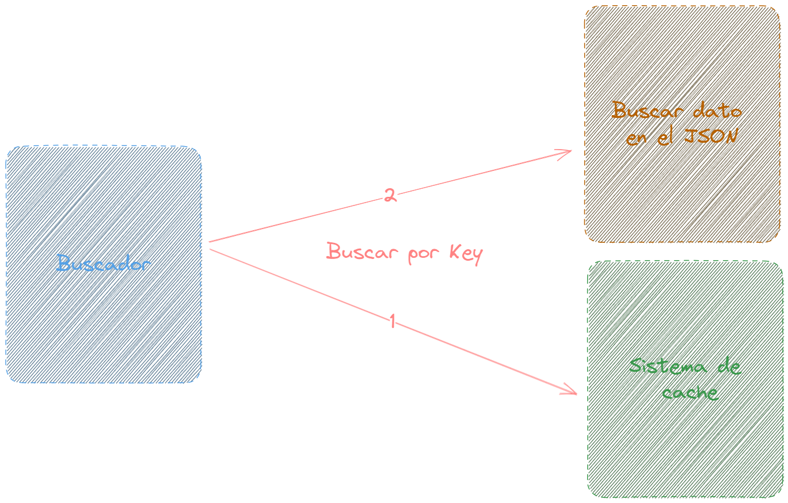

# Servidor casero de cache

## Nodos Maestro y Esclavo:

### Nodo Maestro: 
Es el punto de entrada principal para las solicitudes y es responsable de determinar a qué nodo esclavo se debe reenviar una solicitud específica.
### Nodo Esclavo: 
Almacena datos en caché y responde a las solicitudes de inserción, recuperación y eliminación según las indicaciones del nodo maestro.
Comunicación gRPC:

## GRPC 
Se utiliza gRPC, un marco de RPC (Remote Procedure Call) de alto rendimiento, para la comunicación entre nodos. Las definiciones y contratos de comunicación se definen mediante el lenguaje Protocol Buffers.

## Consistent Hashing con uhashring:

Para garantizar una distribución uniforme de las claves y reducir la reasignación cuando se agregan o eliminan nodos, se utiliza una técnica llamada consistent hashing. La biblioteca uhashring se utiliza para implementar esta funcionalidad.
Algoritmo LRU:

## Funcionamiento

En cada nodo esclavo, se utiliza un algoritmo LRU para gestionar el almacenamiento en caché. Si un nodo alcanza su capacidad máxima, el elemento menos recientemente utilizado se elimina para dar espacio a nuevos elementos.
Funcionalidades Principales:

Registro y Desregistro de Nodos: Los nodos esclavos pueden registrarse y desregistrarse en el nodo maestro.

- Put (Inserción): Inserta un elemento en el caché. Si el caché en un nodo esclavo alcanza su límite, se elimina el elemento menos recientemente utilizado.
- Get (Recuperación): Recupera un elemento del caché si está presente. Actualiza el estado LRU del elemento accedido.
- Remove (Eliminación): Elimina un elemento del caché si está presente.

# Buscador 

## Funcionalidad Principal:
El buscador es la interfaz que interactúa directamente con el servidor de caché para recuperar, insertar o eliminar datos. Se diseñó principalmente para ilustrar el impacto del uso del caché en la eficiencia de la búsqueda.

## Comunicación gRPC:
Utiliza gRPC para enviar solicitudes y recibir respuestas del servidor de caché. Las definiciones y contratos de comunicación, como Get y Put, están definidos por Protocol Buffers.

## Archivo JSON como Fuente de Datos:
El archivo JSON sirve como fuente de datos principal en caso de que el caché no tenga la información solicitada. Este archivo simula una base de datos más lenta, resaltando así la utilidad del caché.

## Funcionamiento:
### Inicialización:
Al iniciarse, el buscador establece una conexión con el servidor de caché y carga el archivo JSON en la memoria para su acceso posterior.

### Get (Recuperación):
- Solicita un valor específico al servidor de caché usando una clave.
- Si el caché tiene la información, la devuelve de inmediato.
- Si no está en el caché, se produce una espera simulada (para imitar el acceso a una fuente de datos más lenta), y luego busca la información en el archivo JSON.
- Una vez recuperada la información del archivo JSON, se inserta en el caché para búsquedas futuras.
###  Simulación de Búsquedas:
- Esta función permite simular una gran cantidad de búsquedas para medir el rendimiento y beneficio del caché:
- Genera claves aleatorias y realiza búsquedas sucesivas.
- Acumula métricas como el tiempo ahorrado gracias al caché y cuántas veces se evitó acceder al archivo JSON.

# Mini diagrama


# Como levantar servidor
```
cd "cache server"
docker compose up
```
